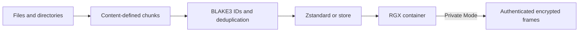

<p align="center">
  
</p>

<p align="center">
  <strong>Compact. Private. Verifiable.</strong><br />
  An experimental archive format and Rust reference implementation.
</p>

<p align="center">
  <a href="https://github.com/0xRech/.rgx/actions/workflows/ci.yml"></a>
  <a href="https://github.com/0xRech/.rgx/actions/workflows/security.yml"></a>
  <a href="https://github.com/0xRech/.rgx/releases"></a>
  <a href="https://github.com/0xRech/.rgx/blob/main/LICENSE"></a>
  
</p>

> [!WARNING]
> **Public alpha (`v0.4.0-alpha.2`).** RGX is unaudited, the format may change before 1.0, and experimental archives may not remain compatible with future versions. Never use RGX as the only copy of important data.

RGX is a custom `.rgx` binary container—not a renamed ZIP file. It combines content-defined chunking, archive-wide deduplication, Zstandard compression, BLAKE3 verification, and optional authenticated encryption in one command-line tool.

## Why RGX?

| Compact | Private | Verifiable |
| --- | --- | --- |
| Content-defined chunks find shared data even when byte offsets move. Identical chunks are stored once across the archive. | Private Mode encrypts file names, paths, structure, hashes, deduplication metadata, and file contents. | Per-chunk and per-file BLAKE3 hashes detect corruption. Private archives also authenticate every encrypted frame. |

## Quick start

Create, inspect, verify, and extract an archive:

```bash
rgx pack ./project project.rgx
rgx list project.rgx
rgx info project.rgx
rgx verify project.rgx
rgx extract project.rgx ./restored-project
```

Create a password-protected archive:

```bash
rgx pack ./project project-private.rgx --private
```

RGX prompts for the password without echoing it. The regular `list`, `info`, `verify`, `find`, `cat`, and `extract` commands automatically recognize private archives and request the password when needed.

## Installation

Prebuilt alpha binaries are available on the [Releases page](https://github.com/0xRech/.rgx/releases):

- Linux x86-64: `rgx-linux-x86_64` (statically linked; no glibc runtime dependency)
- macOS Apple Silicon: `rgx-macos-arm64`
- Windows x86-64: `rgx-windows-x86_64.exe`
- Checksums: `SHA256SUMS`

Verify the downloaded checksum before running a release binary. On Linux and macOS, make it executable first:

```bash
chmod +x rgx-linux-x86_64
./rgx-linux-x86_64 --version
```

To build from source instead:

```bash
git clone https://github.com/0xRech/.rgx.git
cd .rgx
cargo build --release --locked
./target/release/rgx --version
```

## Commands

| Command | Purpose |
| --- | --- |
| `rgx pack INPUT ARCHIVE` | Create an archive. Add `--private` for encryption or `--level 1..22` to select the Zstandard level. |
| `rgx extract ARCHIVE OUTPUT` | Extract into a new output directory. Add `--path ARCHIVE_PATH` for one file or subtree. |
| `rgx list ARCHIVE` | List files and directories without extracting them. |
| `rgx info ARCHIVE` | Show format, size, chunk, and deduplication statistics. |
| `rgx verify ARCHIVE` | Validate structure, chunk hashes, file hashes, and private-envelope authentication. |
| `rgx find ARCHIVE QUERY` | Find paths using a case-insensitive substring search. |
| `rgx cat ARCHIVE PATH` | Verify and write one archived file to standard output. |
| `rgx benchmark INPUT` | Compare RGX with ZIP/Deflate and, when available, 7-Zip. |

Use `rgx help` or `rgx help COMMAND` for the complete CLI reference.

### Selective access

```bash
# Find a path, stream one file, or restore only one subtree
rgx find backup.rgx "report"
rgx cat backup.rgx docs/report.txt
rgx extract backup.rgx ./restored-docs --path docs
```

`rgx cat` intentionally writes the selected file's raw bytes to standard output. Redirect it to a file or pipe it into another program when the data is not terminal-safe.

### Passwords in automation

Use an environment variable instead of putting a password in the process command line:

```bash
RGX_PASSWORD='your passphrase' \
  rgx pack ./project project-private.rgx --private --password-env RGX_PASSWORD

RGX_PASSWORD='your passphrase' \
  rgx verify project-private.rgx --password-env RGX_PASSWORD
```

The environment variable is read only when the command runs. Treat it as a secret and remove it from the environment when it is no longer needed.

## How it works



1. A rolling hash divides file contents into chunks between 64 KiB and 1 MiB, targeting 256 KiB.
2. BLAKE3 identifies equal chunks across every file in the archive.
3. Each unique chunk is compressed with Zstandard, or stored unchanged when compression would make it larger.
4. File records reference chunks and carry an independent BLAKE3 digest of the reconstructed file.
5. Private Mode streams the complete inner container into authenticated 1 MiB encrypted frames.

Private reads seek to and decrypt only the authenticated frames they need; they do not create a complete plaintext temporary archive.

## Private Mode

Private Mode uses established cryptographic primitives; RGX does not introduce custom cryptography.

| Component | Current profile |
| --- | --- |
| Password KDF | Argon2id |
| Memory | 64 MiB |
| Iterations | 3 |
| Parallelism | 1 |
| Authenticated encryption | XChaCha20-Poly1305 |
| Encrypted frame size | 1 MiB |

Every frame uses a unique nonce and authenticates both its frame metadata and the private-envelope header. Modified, reordered, truncated, appended, or incorrectly decrypted data is rejected.

The outer envelope still reveals the approximate total archive size and public cryptographic parameters. For the threat model and reporting process, read [SECURITY.md](SECURITY.md).

## Benchmarking

Run a local comparison on your own data:

```bash
rgx benchmark ./project
rgx benchmark ./project --private
```

The benchmark always measures RGX and a built-in ZIP/Deflate baseline. If `7z`, `7zz`, or `7za` is installed, it also measures normal LZMA2 (`-mx=5`). Private Mode uses a temporary internal benchmark password inside a temporary workspace; no user password is stored.

### Real benchmark snapshots — v0.4.0-alpha.2

The following are **real single-run wall-clock measurements**, not illustrative values. Because the Windows and macOS runs used different machines and slightly different input sets, compare methods **within each platform run**, not Windows directly against macOS. 7-Zip was not installed for these two runs.

#### Windows x86-64

**Input:** 1.25 GiB / 3,113 files · **RGX deduplicated share:** 5.61%

| Method | Archive size | Pack | Extract | Pack MiB/s | Extract MiB/s |
| --- | ---: | ---: | ---: | ---: | ---: |
| RGX | 289.34 MiB | 24.71 s | 15.57 s | 51.9 | 82.4 |
| RGX Private | 289.35 MiB | 14.08 s | 30.13 s | 91.1 | 42.6 |
| ZIP (Deflate) | 318.65 MiB | 37.95 s | 34.26 s | 33.8 | 37.5 |

In this run, plain RGX produced an archive **9.2% smaller than ZIP/Deflate**, with about **1.54×** ZIP's packing throughput and **2.20×** its extraction throughput. The faster RGX Private packing result should **not** be interpreted as an encryption speed advantage; cache state, file-system effects, and run ordering can materially affect a single wall-clock measurement.

#### macOS Apple Silicon

**Input:** 1.09 GiB / 3,413 files · **RGX deduplicated share:** 20.56%

| Method | Archive size | Pack | Extract | Pack MiB/s | Extract MiB/s |
| --- | ---: | ---: | ---: | ---: | ---: |
| RGX | 248.82 MiB | 10.73 s | 2.12 s | 104.3 | 526.9 |
| RGX Private | 248.83 MiB | 11.01 s | 5.11 s | 101.7 | 219.0 |
| ZIP (Deflate) | 304.49 MiB | 22.03 s | 2.95 s | 50.8 | 379.1 |

In this run, plain RGX produced an archive **18.3% smaller than ZIP/Deflate**, with about **2.05×** ZIP's packing throughput and **1.39×** its extraction throughput.

These measurements are benchmark snapshots, not universal performance claims. For the complete observations, methodology notes, and reproduction guidance, see [docs/BENCHMARKS.md](docs/BENCHMARKS.md). When publishing performance claims, run each case multiple times on the same machine and report a median or distribution.

## Format and compatibility

| Layer | Version |
| --- | --- |
| Reference implementation | `v0.4.0-alpha.2` |
| Inner RGX container | v0.2 |
| Private envelope | v0.3 |

The v0.4 reader supports existing v0.3 private archives. Experimental v0.1 inner containers are not compatible with the current v0.2 inner format. The complete binary specification lives in [docs/FORMAT.md](docs/FORMAT.md).

## Current limitations

- RGX is pre-1.0, unaudited, and the format may still change.
- No symbolic-link support.
- Archive paths are stored as UTF-8. Operating-system paths that cannot be represented as valid Unicode are not supported.
- File permissions and timestamps are not preserved yet.
- Fast persisted footer lookup is planned; catalog operations currently read the archive metadata they need.
- Snapshots, incremental updates, recovery blocks, signatures, mount support, and public-key recipient encryption are not implemented yet.
- The encrypted envelope reveals approximate archive size and public KDF/AEAD parameters.

See [docs/ROADMAP.md](docs/ROADMAP.md) for planned work.

## Building and validation

RGX requires Rust 1.88 or newer.

```bash
cargo build --release --locked
cargo fmt --all -- --check
cargo clippy --locked --all-targets --all-features -- -D warnings
cargo test --locked --all-features
```

CI also tests Linux, Windows, and macOS; checks the minimum supported Rust version; audits dependencies; builds a static Linux release; and fuzzes parser entry points.

## Repository layout

```text
src/
  archive.rs       packing, extraction, deduplication, and verification
  benchmark.rs     RGX / ZIP / optional 7-Zip benchmark engine
  chunker.rs       content-defined chunk boundary logic
  format.rs        inner binary-format primitives
  private.rs       authenticated private-envelope I/O
  lib.rs           library entry point
  main.rs          rgx CLI
docs/
  BENCHMARKS.md    measured benchmark snapshots and reproduction notes
  FORMAT.md        binary format and private-envelope specification
  ROADMAP.md       staged development plan
tests/
  benchmark.rs     benchmark coverage
  roundtrip.rs     roundtrip, deduplication, and corruption tests
  private.rs       private-mode, wrong-password, tamper, and leak tests
```

## Contributing

Issues and focused pull requests are welcome. Please read [CONTRIBUTING.md](CONTRIBUTING.md) before contributing and [RELEASE_CHECKLIST.md](RELEASE_CHECKLIST.md) before publishing a release.

Security vulnerabilities should be reported privately as described in [SECURITY.md](SECURITY.md), not through a public issue.

## License

MIT — see [LICENSE](LICENSE).
