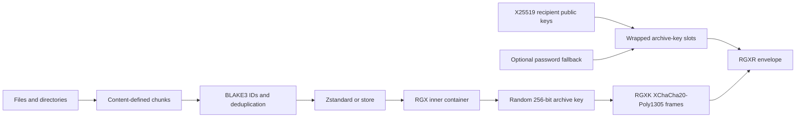

<p align="center">
  
</p>

<p align="center">
  <strong>Compact. Private. Verifiable.</strong><br />
  An experimental archive format and Rust reference implementation.
</p>

<p align="center">
  <a href="https://github.com/0xRech/.rgx/actions/workflows/ci.yml"></a>
  <a href="https://github.com/0xRech/.rgx/actions/workflows/security.yml"></a>
  <a href="https://github.com/0xRech/.rgx/actions/workflows/fuzz.yml"></a>
  <a href="https://github.com/0xRech/.rgx/blob/test/LICENSE"></a>
  
</p>

> [!WARNING]
> **Development preview: `v0.5.0-alpha1` on the `test` branch.** The latest public release on `main` is `v0.4.0-alpha.2`. RGX is unaudited, the format may still change before 1.0, and experimental archives should never be the only copy of important data.

RGX is a custom `.rgx` binary container, not a renamed ZIP file. It combines content-defined chunking, archive-wide deduplication, Zstandard compression, BLAKE3 verification, authenticated encryption, recipient public-key encryption, optional protected private-key files, and detached Ed25519 signatures.

## What is new in v0.5.0-alpha1?

`v0.5.0-alpha1` is the first RGX development version with the recipient-key system integrated end to end:

- X25519 recipient keys with automatic local-key discovery.
- Native `RGXR` + `RGXK` encrypted streaming instead of routing recipient archives through password-based Private Mode.
- Multiple recipients per archive and an optional Argon2id password fallback.
- Optional Argon2id + XChaCha20-Poly1305 protection for RGX private-key files.
- Ed25519 detached archive signatures using the same RGX identity as the trust anchor, with signing material domain-separated from the X25519 secret.
- Recipient-envelope fuzzing in addition to the existing plain-archive parser fuzz target.
- Regression coverage for relative archive output paths across plain, Private, and recipient modes.

## Why RGX?

| Compact | Private | Verifiable |
| --- | --- | --- |
| Content-defined chunks find shared data even when byte offsets move. Identical chunks are stored once across the archive. | Password Private Mode encrypts the complete container. Recipient Mode encrypts with a random archive key and wraps it independently for each X25519 recipient. | Per-chunk and per-file BLAKE3 hashes detect corruption, AEAD detects encrypted-stream tampering, and optional Ed25519 signatures authenticate an archive against a trusted RGX public key. |

## Quick start

Plain archive:

```bash
rgx pack ./project project.rgx
rgx list project.rgx
rgx info project.rgx
rgx verify project.rgx
rgx extract project.rgx ./restored-project
```

Password-protected Private Mode:

```bash
rgx pack ./project project-private.rgx --private
```

Recipient-key mode:

```bash
rgx keygen
rgx pack ./project project-recipient.rgx --recipient ~/.ssh/id_rgx.pub
rgx verify project-recipient.rgx
rgx extract project-recipient.rgx ./restored-project
```

With the matching `~/.ssh/id_rgx`, RGX unlocks a recipient archive without asking for an archive password.

Multiple recipients and optional password fallback:

```bash
rgx pack ./project project-team.rgx \
  --recipient alice_id_rgx.pub \
  --recipient bob_id_rgx.pub \
  --password-fallback
```

## RGX identities

`rgx keygen` creates a dedicated RGX identity. It does not reuse an existing SSH private key.

Default paths:

```text
~/.ssh/id_rgx
~/.ssh/id_rgx.pub
```

The v0.5 public-key file contains an X25519 recipient public key and an Ed25519 signing public key. The Ed25519 signing seed is derived from the private RGX root secret using a separate BLAKE3 derive-key context so the encryption and signing operations use domain-separated key material.

### Passwordless automatic unlock

The default private-key file is intentionally filesystem-protected rather than passphrase-protected so the original RGX workflow remains possible: if the correct private key exists at a standard location, recipient archives can unlock automatically without a password prompt. On Unix, RGX creates the private file with mode `0600`.

### Optional private-key protection at rest

For a cryptographically protected private-key file:

```bash
rgx keygen --protect
```

Or in automation:

```bash
RGX_KEY_CREATE_PASSWORD='strong passphrase' \
  rgx keygen --protect --password-env RGX_KEY_CREATE_PASSWORD
```

Protected RGX private-key files use Argon2id (64 MiB, 3 iterations, 1 lane) to derive a key and XChaCha20-Poly1305 to encrypt/authenticate the private key material.

For recipient commands that need a protected identity, supply the key passphrase through `RGX_KEY_PASSWORD`:

```bash
RGX_KEY_PASSWORD='strong passphrase' \
  rgx verify project-recipient.rgx --identity ~/.ssh/id_rgx
```

This is deliberately separate from an archive password fallback.

## Detached Ed25519 signatures

RGX signatures authenticate the exact archive bytes without changing the `.rgx` container itself. This means the same signing mechanism works for plain, Private, and recipient-protected archives.

```bash
rgx sign backup.rgx --identity ~/.ssh/id_rgx
rgx verify-signature backup.rgx backup.rgx.sig --public-key ~/.ssh/id_rgx.pub
```

The signature file records the signer Key-ID, archive byte length, BLAKE3 digest, and Ed25519 signature. Verification recomputes the archive digest and verifies the signature using the Ed25519 public key in the RGX `.pub` file.

A successful `rgx verify` proves archive integrity. A successful `rgx verify-signature` additionally proves that the exact archive bytes were signed by the holder of the corresponding RGX private key. Trust in that identity still depends on how the public key was obtained and verified.

## Commands

| Command | Purpose |
| --- | --- |
| `rgx pack INPUT ARCHIVE` | Create an archive. Add `--private`, one or more `--recipient PUBLIC_KEY`, `--password-fallback`, or `--level 1..22`. |
| `rgx keygen` | Generate an RGX X25519 + Ed25519 identity. Add `--protect` to encrypt the private-key file. |
| `rgx extract ARCHIVE OUTPUT` | Extract an archive. Add `--path ARCHIVE_PATH` for one file or subtree and `--identity` for an explicit recipient key. |
| `rgx list ARCHIVE` | List files and directories without extracting. |
| `rgx info ARCHIVE` | Show format, size, chunk, deduplication, and recipient-envelope information. |
| `rgx verify ARCHIVE` | Validate structure, hashes, and encrypted-frame authentication. |
| `rgx find ARCHIVE QUERY` | Find archive paths by case-insensitive substring. |
| `rgx cat ARCHIVE PATH` | Verify and write one archived file to standard output. |
| `rgx sign ARCHIVE` | Create a detached Ed25519 `.sig` file. |
| `rgx verify-signature ARCHIVE SIGNATURE --public-key KEY` | Verify archive bytes and signer authenticity against a trusted RGX public key. |
| `rgx benchmark INPUT` | Compare RGX with ZIP/Deflate and, when installed, 7-Zip. |

Use `rgx help` or `rgx help COMMAND` for the full CLI reference.

## How recipient encryption works



1. A rolling hash splits contents into chunks from 64 KiB to 1 MiB, targeting 256 KiB.
2. BLAKE3 identifies identical chunks across the archive.
3. Each unique chunk is compressed with Zstandard or stored raw when compression would make it larger.
4. Recipient Mode generates one random 256-bit archive key.
5. The inner archive is streamed into authenticated 1 MiB `RGXK` frames using XChaCha20-Poly1305.
6. The archive key is wrapped separately for every X25519 recipient.
7. An optional Argon2id password slot can wrap the same archive key as a fallback.
8. The BLAKE3 hash of the recipient envelope is authenticated by the keyed payload, so recipient-slot/header tampering is detected.

`RGXK` implements seekable encrypted reads, so `list`, `find`, `cat`, selective extraction, and verification do not need a full plaintext temporary archive.

## Private Mode vs Recipient Mode

| Property | Private Mode (`RGXE`) | Recipient Mode (`RGXR` + `RGXK`) |
| --- | --- | --- |
| Unlock | Password | Matching X25519 private key; optional password fallback |
| Payload key | Derived from Argon2id password | Random 256-bit archive key |
| Payload AEAD | XChaCha20-Poly1305 | XChaCha20-Poly1305 |
| Streaming | 1 MiB authenticated frames | 1 MiB authenticated frames |
| Multiple recipients | No | Yes, up to 64 in the current experimental envelope |
| Passwordless automatic unlock | No | Yes, with an unprotected local RGX identity |

## Benchmarking

Run benchmarks on your own data:

```bash
rgx benchmark ./project
rgx benchmark ./project --private
```

### Existing real v0.4.0-alpha.2 benchmark snapshots from `main`

These are the existing real single-run measurements already published on `main`. Compare methods inside the same platform run only.

#### Windows x86-64

**Input:** 1.25 GiB / 3,113 files · **RGX deduplicated share:** 5.61%

| Method | Archive size | Pack | Extract | Pack MiB/s | Extract MiB/s |
| --- | ---: | ---: | ---: | ---: | ---: |
| RGX | 289.34 MiB | 24.71 s | 15.57 s | 51.9 | 82.4 |
| RGX Private | 289.35 MiB | 14.08 s | 30.13 s | 91.1 | 42.6 |
| ZIP (Deflate) | 318.65 MiB | 37.95 s | 34.26 s | 33.8 | 37.5 |

#### macOS Apple Silicon

**Input:** 1.09 GiB / 3,413 files · **RGX deduplicated share:** 20.56%

| Method | Archive size | Pack | Extract | Pack MiB/s | Extract MiB/s |
| --- | ---: | ---: | ---: | ---: | ---: |
| RGX | 248.82 MiB | 10.73 s | 2.12 s | 104.3 | 526.9 |
| RGX Private | 248.83 MiB | 11.01 s | 5.11 s | 101.7 | 219.0 |
| ZIP (Deflate) | 304.49 MiB | 22.03 s | 2.95 s | 50.8 | 379.1 |

### v0.5.0-alpha1 recipient implementation test

A deterministic synthetic Linux test used **109.02 MiB / 1,392 files** with a mix of small text files, random 1 MiB files, repeated files, and compressible patterns. The dataset produced a **77.77% deduplicated logical share**. Three runs were performed on the same GitHub Actions runner; the table below reports the median wall-clock result.

| Method | Archive size | Pack median | Extract median |
| --- | ---: | ---: | ---: |
| RGX | 24.18 MiB | 0.63 s | 0.18 s |
| RGX Recipient | 24.18 MiB | 0.64 s | 0.46 s |
| RGX Private | 24.18 MiB | 0.74 s | 0.52 s |
| ZIP (Deflate) | 96.30 MiB | 3.26 s | 0.19 s |

On this synthetic dataset, native Recipient Mode packed about **13.5% faster** and extracted about **11.5% faster** than password-based Private Mode. Recipient extraction remained slower than plain RGX because every encrypted frame must be authenticated and decrypted. These numbers are not universal performance claims; hardware, cache state, storage, data composition, run order, and dataset size matter.

For the existing public benchmark methodology and platform snapshots, see [docs/BENCHMARKS.md](docs/BENCHMARKS.md).

## Format and compatibility

| Layer | Version on `test` |
| --- | --- |
| Reference implementation | `v0.5.0-alpha1` |
| Inner RGX container | v0.2 |
| Password Private envelope | v0.4 |
| Recipient envelope | v2 |
| Native keyed payload stream | RGXK v1 |
| RGX key files | v2, with v1 recipient-key reading retained where applicable |
| Detached signature file | v1 / Ed25519 |

The `v0.5.0-alpha1` recipient and key features are experimental. The public `main` branch remains on `v0.4.0-alpha.2` until the new branch is reviewed and intentionally promoted.

## Validation and tests

RGX requires Rust 1.88 or newer.

```bash
cargo build --release --locked
cargo fmt --all -- --check
cargo clippy --locked --all-targets --all-features -- -D warnings
cargo test --locked --all-features
```

The test branch validation covers:

- Linux, Windows, and macOS test jobs.
- Minimum supported Rust 1.88.
- Static Linux musl release build.
- `cargo fmt` and Clippy with warnings denied.
- Dependency advisories, licenses, bans, and source checks.
- Plain, password Private, and recipient archive roundtrips.
- Automatic recipient identity discovery and explicit identities.
- Multiple recipients and password fallback.
- Wrong passwords/keys and invalid CLI combinations.
- Payload tamper rejection and detached-signature tamper rejection.
- Selective extraction, `list`, `find`, `cat`, `info`, and `verify` paths.
- Relative archive output paths for all three protection modes.
- Fuzz smoke tests for the plain archive parser and recipient-envelope parser.

## Security notes and current limitations

- RGX remains pre-1.0 and has not received an independent cryptographic audit.
- Recipient keys are dedicated RGX keys; arbitrary SSH keys are not reused.
- An unprotected identity enables passwordless automatic unlock but relies on filesystem/OS account protection. Use `rgx keygen --protect` when at-rest cryptographic protection is more important than zero-prompt unlock.
- On Unix, private-key creation uses mode `0600`. Windows-specific hardened ACL management, OS keychain integration, TPMs, smart cards, and hardware tokens are future work.
- Password fallback is opt-in and makes archive confidentiality depend on both the recipient-key security and the strength of the fallback password.
- Stable recipient Key-IDs can correlate use of the same public key across archives.
- Detached signatures prove possession of the corresponding private key, not the real-world identity of the key owner. Public-key trust must be established separately.
- No symbolic-link support. File permissions and timestamps are not preserved yet.
- Snapshots, incremental updates, recovery blocks, mount support, and persisted fast footer lookup remain future work.

For the threat model and vulnerability-reporting process, read [SECURITY.md](SECURITY.md). For recipient-key details, read [docs/RECIPIENT_KEYS.md](docs/RECIPIENT_KEYS.md).

## Repository layout

```text
src/
  archive.rs            packing, extraction, deduplication, verification
  benchmark.rs          RGX / ZIP / optional 7-Zip benchmark engine
  chunker.rs            content-defined chunking
  format.rs             inner binary-format primitives
  private.rs            password-based authenticated envelope
  keyed_stream.rs       native seekable encrypted RGXK stream
  recipient.rs          RGX identities, X25519 wrapping, protected key files
  recipient_archive.rs  RGXR envelope and recipient archive access
  signature.rs          detached Ed25519 archive signatures
  main.rs               rgx CLI
fuzz/
  fuzz_targets/plain_archive.rs
  fuzz_targets/recipient_envelope.rs
tests/
  benchmark.rs
  roundtrip.rs
  private.rs
  cli.rs
  relative_paths.rs
  signature_cli.rs
```

## Contributing

Issues and focused pull requests are welcome. Read [CONTRIBUTING.md](CONTRIBUTING.md) before contributing and [RELEASE_CHECKLIST.md](RELEASE_CHECKLIST.md) before publishing a release.

Security vulnerabilities should be reported privately as described in [SECURITY.md](SECURITY.md), not through a public issue.

## License

MIT — see [LICENSE](LICENSE).
