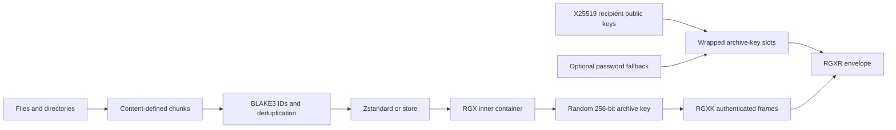

<p align="center">
  <a href="https://rgx.rech-group.de/">
    
  </a>
</p>

<h1 align="center">The modern archive format for private, verifiable data.</h1>

<p align="center">
  <strong>Compact. Private. Verifiable.</strong><br />
  Deduplicate, compress, encrypt, share, and verify — in one Rust-native archive format.
</p>

<p align="center">
  <a href="https://rgx.rech-group.de/"></a>
  <a href="https://github.com/0xRech/.rgx/releases"></a>
  <a href="docs/ROADMAP.md"></a>
</p>

<p align="center">
  <a href="https://github.com/0xRech/.rgx/actions/workflows/ci.yml"></a>
  <a href="https://github.com/0xRech/.rgx/actions/workflows/security.yml"></a>
  <a href="https://github.com/0xRech/.rgx/actions/workflows/fuzz.yml"></a>
  <a href="https://github.com/0xRech/.rgx/blob/main/Cargo.toml"></a>
  <a href="https://github.com/0xRech/.rgx/blob/main/LICENSE"></a>
  
</p>

<p align="center">
  <a href="#quick-start">Quick start</a> · <a href="#why-rgx">Why RGX?</a> ·
  <a href="#rgx-identities">Identity keys</a> · <a href="#benchmarking">Benchmarks</a> ·
  <a href="#security-notes-and-current-limitations">Security</a> · <a href="https://rgx.rech-group.de/">Website</a>
</p>

<p align="center">
  
</p>

> [!WARNING]
> **Public alpha (`v0.5.0-alpha1`).** RGX is pre-1.0 and has not received an independent cryptographic audit. The format can still change before 1.0. Never keep important data only in an experimental RGX archive.

RGX is a custom `.rgx` binary container, not a renamed ZIP file. It combines content-defined chunking, archive-wide deduplication, Zstandard compression, BLAKE3 verification, password-based authenticated encryption, X25519 recipient encryption, optionally protected RGX identities, and detached Ed25519 signatures.

## Project status

| Stage | Platforms | Implementation | Security |
| --- | --- | --- | --- |
| 🧪 Public alpha | 🪟 Windows · 🍎 macOS · 🐧 Linux | 🦀 Rust 1.88+ | 🔐 Independent audit pending |

> RGX is building toward a stable 1.0 format. Alpha archives remain experimental and the binary format may still change.

## RGX at a glance

| Capability | RGX approach |
| --- | --- |
| **Smaller archives** | Content-defined chunking, archive-wide deduplication, and Zstandard compression |
| **Private storage** | Argon2id and authenticated XChaCha20-Poly1305 streaming |
| **Secure sharing** | X25519 recipient encryption for one or many recipients |
| **Automatic unlock** | A matching local RGX identity can unlock archives without an archive password |
| **Integrity** | BLAKE3 hashes plus authenticated encrypted frames |
| **Authenticity** | Detached Ed25519 signatures over the exact archive bytes |

## What is new in v0.5.0-alpha1?

`v0.5.0-alpha1` adds the first end-to-end RGX identity and recipient-key system:

- **X25519 recipients** with automatic local identity discovery.
- Native **`RGXR v2` + `RGXK v1`** encrypted streaming rather than routing recipient archives through password Private Mode.
- **Multiple recipients** per archive and an optional Argon2id password fallback.
- Optional **Argon2id + XChaCha20-Poly1305 protection for private RGX identity files**.
- **Ed25519 detached signatures** using signing material domain-separated from the recipient secret.
- Strict detached-signature parsing and rejection of modified archive bytes, signature bytes, wrong signer keys, and trailing signature data.
- Recipient-envelope fuzzing in addition to the plain archive parser fuzz target.
- Regression coverage for relative output paths across plain, Private, and recipient modes.

## Why RGX?

| Compact | Private | Verifiable |
| --- | --- | --- |
| Content-defined chunks find shared data even when byte offsets move. Identical chunks are stored once across the archive. | Private Mode encrypts the whole container with a password. Recipient Mode encrypts with a random archive key and wraps it separately for each X25519 recipient. | BLAKE3 detects corruption, AEAD rejects encrypted-stream tampering, and optional Ed25519 signatures authenticate exact archive bytes against a trusted RGX public key. |

## Choose your RGX mode

| Mode | Unlock | Encryption | Best suited for |
| --- | --- | --- | --- |
| **Plain** | None | No | Compact archives with integrity verification |
| **Private** | Password | Yes | Personal encrypted backups and transfers |
| **Recipient** | Matching RGX identity; optional password fallback | Yes | Passwordless sharing, teams, and automation |

## Quick start

Plain archive:

```bash
rgx pack ./project project.rgx
rgx list project.rgx
rgx info project.rgx
rgx verify project.rgx
rgx extract project.rgx ./restored-project
```

Password-protected Private Mode:

```bash
rgx pack ./project project-private.rgx --private
```

Recipient-key mode:

```bash
rgx keygen
rgx pack ./project project-recipient.rgx --recipient ~/.ssh/id_rgx.pub
rgx verify project-recipient.rgx
rgx extract project-recipient.rgx ./restored-project
```

With the matching unprotected `~/.ssh/id_rgx`, RGX unlocks the recipient archive automatically without an archive password.

Multiple recipients plus optional password fallback:

```bash
rgx pack ./project project-team.rgx \
  --recipient alice_id_rgx.pub \
  --recipient bob_id_rgx.pub \
  --password-fallback
```

## Installation

The source on `main` is currently **v0.5.0-alpha1**. Prebuilt alpha binaries are published on the [Releases page](https://github.com/0xRech/.rgx/releases) when a matching release is cut. To build the current source:

```bash
git clone https://github.com/0xRech/.rgx.git
cd .rgx
cargo build --release --locked
./target/release/rgx --version
```

RGX requires Rust 1.88 or newer.

## RGX identities

`rgx keygen` creates a dedicated RGX identity; RGX does **not** reuse arbitrary SSH private keys.

Default paths:

```text
~/.ssh/id_rgx
~/.ssh/id_rgx.pub
```

The v2 public-key file carries the X25519 recipient public key and an Ed25519 verification key. Signing material is derived using a separate BLAKE3 derive-key context so encryption and signing use domain-separated key material.

### Passwordless automatic unlock

By default the private identity relies on filesystem/OS account protection. On Unix, RGX creates it with mode `0600`. This preserves the zero-prompt workflow: if the correct key is in a standard location, a recipient archive can unlock automatically.

### Protected private identities

To encrypt the identity file itself:

```bash
rgx keygen --protect
```

For automation:

```bash
RGX_KEY_CREATE_PASSWORD='strong passphrase' \
  rgx keygen --protect --password-env RGX_KEY_CREATE_PASSWORD
```

Protected RGX private-key files use Argon2id (64 MiB, 3 iterations, 1 lane) and XChaCha20-Poly1305. For recipient operations using a protected identity, provide its passphrase through `RGX_KEY_PASSWORD`:

```bash
RGX_KEY_PASSWORD='strong passphrase' \
  rgx verify project-recipient.rgx --identity ~/.ssh/id_rgx
```

The identity passphrase is separate from an archive password fallback.

## Detached Ed25519 signatures

Signatures authenticate the exact `.rgx` bytes without modifying the archive itself, so they work for plain, Private, and recipient archives:

```bash
rgx sign backup.rgx --identity ~/.ssh/id_rgx
rgx verify-signature backup.rgx backup.rgx.sig --public-key ~/.ssh/id_rgx.pub
```

The detached signature records the signer Key-ID, exact archive length, BLAKE3 archive digest, and Ed25519 signature. `rgx verify` validates archive integrity; `rgx verify-signature` additionally proves that the exact archive bytes were signed by the holder of the corresponding RGX private identity. The real-world trustworthiness of that identity still depends on how its public key was exchanged and verified.

## Commands

| Command | Purpose |
| --- | --- |
| `rgx pack INPUT ARCHIVE` | Create an archive. Add `--private`, one or more `--recipient PUBLIC_KEY`, `--password-fallback`, or `--level 1..22`. |
| `rgx keygen` | Generate an X25519 + Ed25519 RGX identity. Add `--protect` for encrypted private-key storage. |
| `rgx extract ARCHIVE OUTPUT` | Extract an archive. Add `--path ARCHIVE_PATH` for one file/subtree and `--identity` for an explicit recipient identity. |
| `rgx list ARCHIVE` | List files and directories without extracting. |
| `rgx info ARCHIVE` | Show format, size, chunk, deduplication, and recipient-envelope information. |
| `rgx verify ARCHIVE` | Validate structure, BLAKE3 hashes, and encrypted-frame authentication. |
| `rgx find ARCHIVE QUERY` | Find paths by case-insensitive substring. |
| `rgx cat ARCHIVE PATH` | Verify and write one archived file to standard output. |
| `rgx sign ARCHIVE` | Create a detached Ed25519 `.sig` file. |
| `rgx verify-signature ARCHIVE SIGNATURE --public-key KEY` | Verify exact archive bytes and signer authenticity against a trusted RGX public key. |
| `rgx benchmark INPUT` | Compare RGX with ZIP/Deflate and, when installed, 7-Zip. |

Use `rgx help` or `rgx help COMMAND` for the complete CLI reference.

## How recipient encryption works



1. A rolling hash splits file contents into chunks between 64 KiB and 1 MiB, targeting 256 KiB.
2. BLAKE3 identifies equal chunks archive-wide.
3. Every unique chunk is compressed with Zstandard or stored raw when compression would be larger.
4. Recipient Mode creates one random 256-bit archive key.
5. The inner archive is streamed directly into authenticated 1 MiB `RGXK` XChaCha20-Poly1305 frames.
6. The archive key is wrapped separately for every X25519 recipient.
7. An optional Argon2id password slot can wrap the same archive key as a fallback.
8. The BLAKE3 hash of the recipient envelope is bound into the authenticated payload header, so recipient-slot/header tampering is detected.

The keyed reader implements `Read + Seek`, allowing `list`, `find`, `cat`, selective extraction, and verification without materializing a full decrypted temporary archive.

## Private Mode vs Recipient Mode

| Property | Private Mode (`RGXE`) | Recipient Mode (`RGXR` + `RGXK`) |
| --- | --- | --- |
| Unlock | Password | Matching X25519 identity; optional password fallback |
| Payload key | Argon2id-derived password key | Random 256-bit archive key |
| Payload AEAD | XChaCha20-Poly1305 | XChaCha20-Poly1305 |
| Streaming | 1 MiB authenticated frames | 1 MiB authenticated frames |
| Multiple recipients | No | Yes, up to 64 in recipient envelope v2 |
| Passwordless automatic unlock | No | Yes, with an unprotected local RGX identity |

## Benchmarking

Run local benchmarks on your own data:

```bash
rgx benchmark ./project
rgx benchmark ./project --private
```

### Real v0.4.0-alpha.2 platform snapshots

These measurements remain useful as the existing real-machine baseline. Compare methods **within a platform run**, not Windows directly with macOS.

#### Windows x86-64

**Input:** 1.25 GiB / 3,113 files · **RGX deduplicated share:** 5.61%

| Method | Archive size | Pack | Extract | Pack MiB/s | Extract MiB/s |
| --- | ---: | ---: | ---: | ---: | ---: |
| RGX | 289.34 MiB | 24.71 s | 15.57 s | 51.9 | 82.4 |
| RGX Private | 289.35 MiB | 14.08 s | 30.13 s | 91.1 | 42.6 |
| ZIP (Deflate) | 318.65 MiB | 37.95 s | 34.26 s | 33.8 | 37.5 |

#### macOS Apple Silicon

**Input:** 1.09 GiB / 3,413 files · **RGX deduplicated share:** 20.56%

| Method | Archive size | Pack | Extract | Pack MiB/s | Extract MiB/s |
| --- | ---: | ---: | ---: | ---: | ---: |
| RGX | 248.82 MiB | 10.73 s | 2.12 s | 104.3 | 526.9 |
| RGX Private | 248.83 MiB | 11.01 s | 5.11 s | 101.7 | 219.0 |
| ZIP (Deflate) | 304.49 MiB | 22.03 s | 2.95 s | 50.8 | 379.1 |

### v0.5.0-alpha1 recipient implementation test

A deterministic synthetic Linux test used **109.02 MiB / 1,392 files**, mixing small text files, random 1 MiB files, repeated files, and compressible patterns. It produced a **77.77% deduplicated logical share**. Three runs were made on the same GitHub Actions runner; the table reports medians.

| Method | Archive size | Pack median | Extract median |
| --- | ---: | ---: | ---: |
| RGX | 24.18 MiB | 0.63 s | 0.18 s |
| RGX Recipient | 24.18 MiB | 0.64 s | 0.46 s |
| RGX Private | 24.18 MiB | 0.74 s | 0.52 s |
| ZIP (Deflate) | 96.30 MiB | 3.26 s | 0.19 s |

On this synthetic dataset, native Recipient Mode packed about **13.5% faster** and extracted about **11.5% faster** than password-based Private Mode. These are benchmark snapshots, not universal performance claims. Hardware, cache state, storage, data composition, and run order materially affect timings.

For methodology and reproduction notes, see [docs/BENCHMARKS.md](docs/BENCHMARKS.md).

## Format and compatibility

| Layer | Version |
| --- | --- |
| Reference implementation | `v0.5.0-alpha1` |
| Inner RGX container | v0.2 |
| Password Private envelope | v0.4 |
| Recipient envelope | RGXR v2 |
| Native keyed payload stream | RGXK v1 |
| RGX identity files | v2; legacy v1 recipient-key reading retained where applicable |
| Detached signature file | v1 / Ed25519 |

The v0.5 reader keeps the existing plain RGX and password Private Mode behavior while adding recipient archives and signatures. Pre-1.0 format revisions can still be breaking.

## Validation and tests

The normal validation commands are:

```bash
cargo build --release --locked
cargo fmt --all -- --check
cargo clippy --locked --all-targets --all-features -- -D warnings
cargo test --locked --all-features
```

CI additionally covers Linux, Windows, macOS, the Rust 1.88 MSRV, static Linux/musl builds, dependency audits, CodeQL, and parser fuzzing. Integration/regression coverage includes plain, Private, and recipient roundtrips; automatic and explicit identities; multiple recipients; password fallback; protected identities; wrong-password/key rejection; payload and detached-signature tampering; strict signature-file parsing; selective access; relative outputs; and recipient-envelope fuzzing.

## Security notes and current limitations

- RGX is pre-1.0 and **unaudited**; passing tests is not equivalent to an independent cryptographic review.
- Recipient identities are dedicated RGX keys; arbitrary SSH keys are not reused.
- An unprotected private identity enables passwordless automatic unlock but relies on filesystem/OS account protection. Use `rgx keygen --protect` when at-rest cryptographic protection matters more than zero-prompt unlock.
- Unix private-key creation uses mode `0600`. Windows-specific ACL hardening, OS keychain integration, TPMs, smart cards, and hardware tokens remain future work.
- Password fallback is opt-in and makes confidentiality additionally depend on fallback-passphrase strength.
- Stable recipient Key-IDs can correlate reuse of the same public key across archives.
- Detached signatures prove possession of the corresponding private identity, not the real-world identity of its holder. Public-key trust must be established separately.
- No symbolic-link support. File permissions and timestamps are not preserved yet.
- Snapshots, incremental updates, recovery blocks, mount support, and persisted fast footer lookup remain future work.

For the threat model and reporting process, read [SECURITY.md](SECURITY.md). Recipient details are in [docs/RECIPIENT_KEYS.md](docs/RECIPIENT_KEYS.md), and the binary layouts are in [docs/FORMAT.md](docs/FORMAT.md).

## What's next?

RGX is moving toward a stable, auditable 1.0 format. Major goals include:

- Windows ACL hardening and native OS keychain integration.
- Recovery blocks and stronger damaged-archive resilience.
- Incremental archives, snapshots, and efficient updates.
- Archive mounting and persisted fast footer lookup.
- An independent cryptographic and format security review.

Follow the complete and evolving plan in the **[RGX roadmap](docs/ROADMAP.md)**.

## Project website

<p align="center">
  <a href="https://rgx.rech-group.de/">
    
  </a>
</p>

Architecture, security concepts, project updates, downloads, and the story behind RGX are available at **[rgx.rech-group.de](https://rgx.rech-group.de/)**.

## Repository layout

```text
src/
  archive.rs             packing, extraction, deduplication, verification
  benchmark.rs           RGX / ZIP / optional 7-Zip benchmark engine
  chunker.rs             content-defined chunking
  format.rs              inner RGX binary-format primitives
  private.rs             password Private Mode (RGXE)
  keyed_stream.rs        native recipient encrypted stream (RGXK)
  recipient.rs           RGX identities, key wrapping, key-file protection
  recipient_archive.rs   recipient envelope (RGXR)
  signature.rs           detached Ed25519 signatures
  main.rs                CLI

docs/
  BENCHMARKS.md          benchmark snapshots and methodology
  FORMAT.md              binary-format specification
  RECIPIENT_KEYS.md      recipient identity design and usage
  ROADMAP.md             development roadmap
fuzz/fuzz_targets/
  plain_archive.rs       plain archive parser fuzz target
  recipient_envelope.rs  recipient envelope parser fuzz target
tests/
  cli.rs                 CLI and recipient integration coverage
  private.rs             Private Mode security/regression tests
  recipient.rs           recipient archive coverage
  relative_paths.rs      relative-output regression test
  roundtrip.rs           archive/deduplication/corruption coverage
  signature_cli.rs       signing/verification CLI coverage
```

## Contributing

Issues and focused pull requests are welcome. Read [CONTRIBUTING.md](CONTRIBUTING.md) before contributing and [RELEASE_CHECKLIST.md](RELEASE_CHECKLIST.md) before publishing a release.

Security vulnerabilities should be reported privately as described in [SECURITY.md](SECURITY.md), not through a public issue.

## License

MIT — see [LICENSE](LICENSE).
